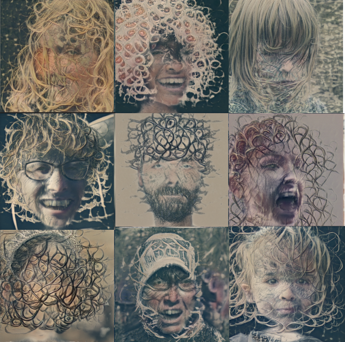
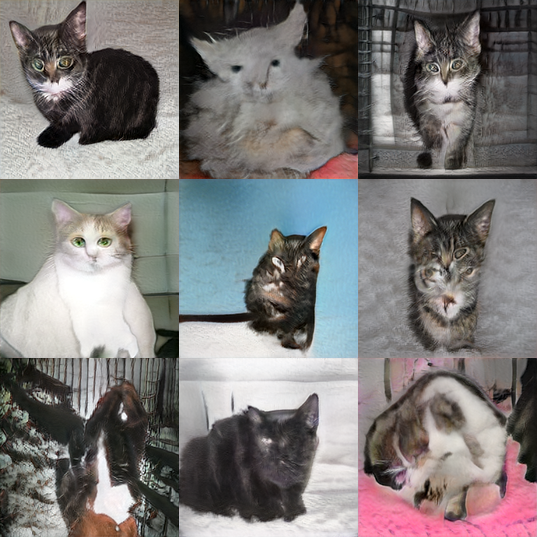
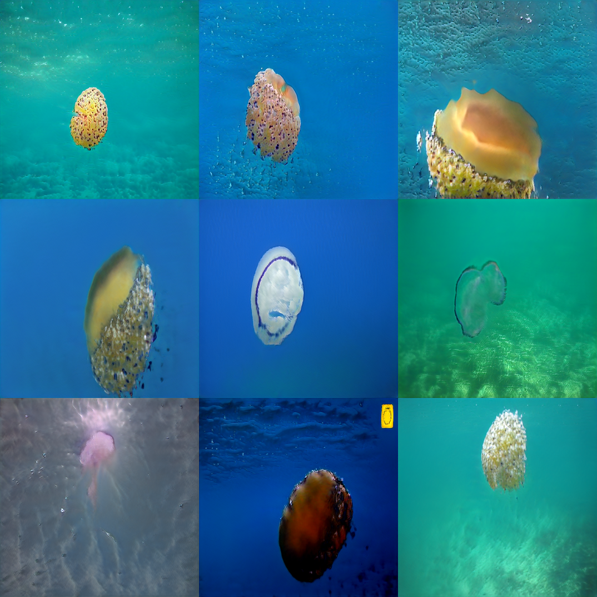

## SGAN
Easy impelementation of stylegans2. You can literally train a stylegan2 in less than 10 lines of code. 

## Notebooks 

<table class="tg">
  <tr>
    <th class="tg-yw4l"><b>Name</b></th>
    <th class="tg-yw4l"><b>Notebook</b></th>
  </tr>
  <tr>
    <td class="tg-yw4l">Training</td>
    <td class="tg-yw4l"><a href="https://colab.research.google.com/github/zaidalyafeai/sgan/blob/master/SGAN_Train.ipynb">
  
</a></td>
  </tr>
  <tr>
    <td class="tg-yw4l">Visualization</td>
    <td class="tg-yw4l"><a href="https://colab.research.google.com/github/zaidalyafeai/sgan/blob/master/SGAN_Vis.ipynb">
  
</a></td>
  </tr>
</table>


## Training 
In just a few lines you can use style tranfer or train a stylegan from scratch. 

```python 

from datasets import Dataset
from sgan import SGAN

dataset = Dataset('/path/to/dataset')
dataset.prepare('path/to/records')

model = SGAN()
model.train(data_path = 'path/to/records', out_dir = 'path/to/out')

```

## Visualization 
A set of functions for vis, interpolation and animation. Mostly tested in colab notebooks. 

### Load Model 
```python 
from sgan import SGAN
model = SGAN(pkl_path = '/path/to/pkl')
```

### Generate random 
```python 
sgan.generate_randomly()
```

### Generate grid 
```python 
model.generate_grid()
```

### Generate animation 
```python
model.generate_animation(size = 2, steps = 20)
```

## Sample Models 

### Mosaics 


### Medusas


### Cats 


### Jellfish


### Celebs 


## References 
- Gan-surgery: https://github.com/aydao/stylegan2-surgery
- WikiArt model: https://github.com/pbaylies/stylegan2 
- Starter-Notebook: https://github.com/Hephyrius/Stylegan2-Ada-Google-Colab-Starter-Notebook/
